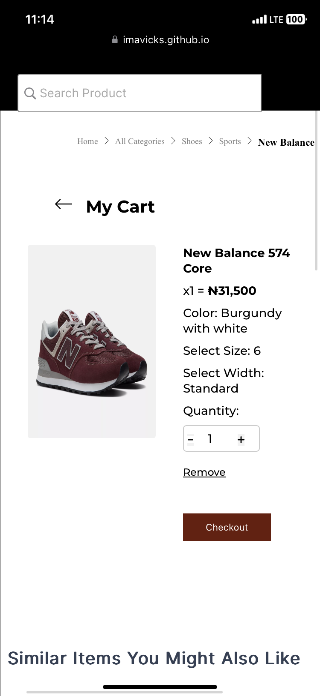

# projectGenisys || E-commerce Web APP
Project to build a simple E-commerce Web App

<h2 id = "built"><b>Built With:</b></h2>

  

Table of Contents

- [Introduction](#introduction)
- [Showcase](#showcase)
- [User Experience](#ux-user-experience)
  - [New Users](#newuser)
  - [All Users](#allusers)
  - [Site Owners](#sitegoals)
- [Features](#features)
  - [Header](#header)
  - [Product](#header)
    - [Description](#description)
    - [Specification](#specification)
    - [Content of Delivery](#content-of-delivery)
    - [Rating Tab](#rating-tab)
  - [Cart](#cart)
    - [empty cart](#empty-cart)
  - [Checkout](#checkout)
  - [Mobile View](#mobile-view)
- [Acessiblity](#accesibility)
- [Collaboration](#collaboration)
- [Acknowledgments](#acknowledgments)

---

## Introduction
- SOW: An ecommerce website has requested revamping of its product details page to make it easier for users to be able to see and clearly understand the value of the product and see its various colors or sizes where needed respectively.
---
## Showcase

A deployed version of the website can be found [here](https://imavicks.github.io/projectGenisys/)

---

<h2 id = "ux-user-experience">UX (User Experience)</h2>

<h3 id="newuser">As a New User</h3>

- I want to clearly see the picture of the product and additional images
- I want to know the price of the product and if there is any discount on the product
- I want to see information about the product I am buying
- I want to know which active thumbnail image is selected

<h3 id="allusers">All Users</h3>

- I want there to be a main image and smaller images to see different views of the product
- I want to click on the thumbnail and it changes the main image to correspond to the image I clicked on
- I want to add the product to the cart, by clicking the plus sign and clicking the 'Add to Cart' button will add the amount stated to the cart
- I want to see if the cart is either empty or has the product added to the cart
- I want to be able to delete all items in the cart
- I want to be able to checkout the items in the cart

<h3 id="sitegoals">Site Owner Goals</h3>

- As site owners, we want to ensure the user has an ease of navigation
- As site owners, we want the user to be able to select as many pairs of shoes to add to the cart
- As site owners, we want the user to be able to delete the items in the cart or checkout the items in the cart
- As site owners, we want the user to have the same experience as on desktop and on mobile where they can navigate through all the images on their phone.
---

## Features
Here are some of the features of our website -
### Header

### Product

### Description

### Specification 

### Content of Delivery

### Rating Tab

### Cart

### Empty Cart

### Checkout 

### Mobile View

---

## Technologies Used

[Figma](https://www.figma.com)

- We used Figma to incorporate our design. link to our Figma design is  [here](https://www.figma.com/file/QLFeUrU4KgyUHHBX3Tb8O4/SOW?type=design&node-id=3%3A1634&t=XJBhJ0yBjj0SGtj9-1)

[HTML5](https://en.wikipedia.org/wiki/HTML5)

- The project uses HTML to create the basic elements and content of the web pages.

[CSS](https://en.wikipedia.org/wiki/CSS)

- The project uses CSS linked externally to apply the custom styles to create the look of E-commerce website.

[JavaScript](https://en.wikipedia.org/wiki/JavaScript)

- The project uses JavaScript to add functionality and interactivity to the web pages.

[Font Awesome](https://fontawesome.com/v4.7/)

- The project uses Font Awesome icons for icons, especially on our similar items section.

[Google Fonts](https://fonts.google.com)

- Google fonts was used to import our default font - Montserrat into the CSS which is used on all pages throughout the project.

[Visual Studio Code](https://code.visualstudio.com)

- We used Visual Studio Code as the development environment to write the code for our website

[Git](https://git-scm.com)

- We used Git as a version control system to regularly add and commit changes made to project on Visual Studio Code, before pushing them to GitHub.

[GitHub](https://github.com)

- We used GitHub as a remote repository to push and store the committed changes to our project from Git. We also used GitHub pages to deploy our website in a live environment.

---
## Accesibility
  - This project is easily accessible on any browser. It is mobile responsive, which means it can be viewed both on mobile or desktop devices.

---
## Collaboration
- We built this project by collaborative efforts. Our team consists of 11 contributors
  - 5 Frontenders:
    victor.imazobi@gmail.com,
    paulkwenye@gmail.com,
    amaranwamara@gmail.com,
    kaforglo122@yahoo.com,
    kolawole.adedeji10@gmail.com,
  - 4 backenders:
    emma.osademe@gmail.com,
    igbokwegregory1@gmail.com,
    towolabi151@gmail.com,
    mykelchris87@gmail.com,
    and
  - 2 product designers:
    bomachris9@gmail.com,
    dnlladoga@gmail.com,
---

## Acknowledgments

 - First, we would like to thank the [Seamfix NextGen Academy](https://seamfixnextgen.com/) for providing us this amazing platform for learning. Over the past few months on their tech program, we've grown and learnt alot.
  - We would also like to thank our mentors and instructors - 
phildeoner@gmail.com, daniel.o.umoren@gmail.com, jikhile@seamfix.com and fbadejo@seamfix.com for their honest, helpful and continuous feedbacks.

---

_**Team Genisys**_

 

